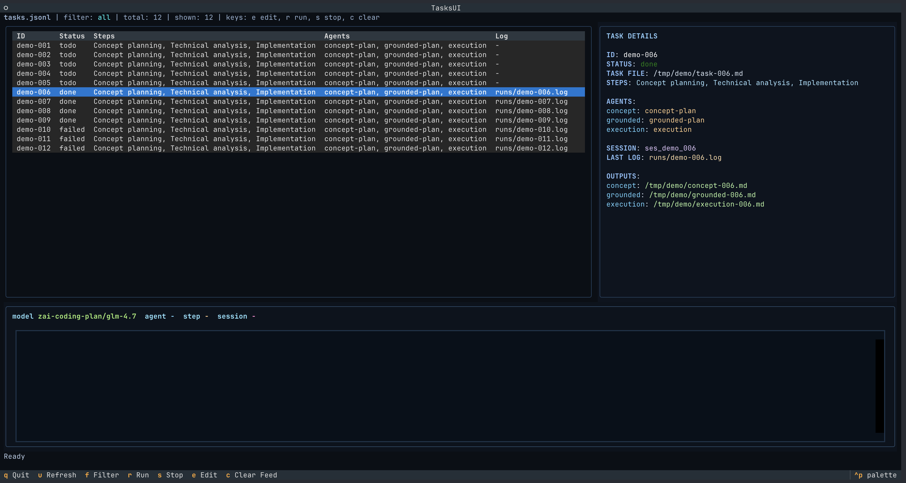

# FlowForge TUI



FlowForge TUI is a terminal task manager for running a multi-agent pipeline from `tasks.jsonl`.

It solves two core problems:
- managing a task backlog (`todo/done/failed`) in one place;
- running a multi-step AI workflow (`concept -> grounded -> execution`) with live logs and persisted results.

## What It Is For

This tool is useful when you have a long JSON task list and want to:
- pick tasks from a table in the terminal;
- edit steps, agents, and step names on the fly;
- run tasks and watch live events in the same screen;
- stop execution manually;
- automatically write `status`, `session_id`, `last_run_log`, and `outputs` back to `tasks.jsonl`.

## Architecture

- `tasks-ui.py`
  - main Textual UI;
  - tasks table + task details + live events feed;
  - run/stop/edit task actions.
- `pipeline_runner.py`
  - headless execution engine;
  - runs steps, streams events, writes logs, and updates `tasks.jsonl`.
- `run-task.py`
  - thin CLI wrapper over `pipeline_runner.py`.

## Requirements

- Python 3.10+
- `opencode` installed and available in `PATH`
- Python packages:

```bash
pip install textual rich
```

## Configuration (Environment Variables)

Runtime paths/model are required via environment variables:

- `PROJECT_DIR` — target repository path where tasks are executed
- `TASKS_FILE` — path to the `tasks.jsonl` file
- `MODEL` — model passed to `opencode run --model`

There is no fallback anymore: all three variables must be set (via shell env or `.env`).

Example:

```bash
export PROJECT_DIR="/path/to/project"
export TASKS_FILE="/path/to/tasks.jsonl"
export MODEL="model-name"
python3 tasks-ui.py
```

## Quick Start

### 1. Run the UI

```bash
python3 tasks-ui.py
```

### 2. Use the UI

- `r` — run selected task
- `s` — stop active run
- `e` — edit `steps/agents/step_labels`
- `f` — cycle filter (`all/todo/failed/done`)
- `u` — refresh table
- `c` — clear events feed
- `q` — quit

### 3. Run from CLI (no UI)

```bash
python3 run-task.py
```

Runs the next task with status `todo`.

Run a specific task:

```bash
python3 run-task.py --task-id f2-d8
```

## Task Format (`tasks.jsonl`)

Each line is one JSON task object.

Minimal example:

```json
{"id":"f2-d8","task_file":"/abs/path/to/task.md","status":"todo"}
```

Extended example:

```json
{
  "id": "f2-d8",
  "task_file": "/abs/path/to/task.md",
  "status": "todo",
  "steps": ["concept", "grounded", "execution"],
  "agents": {
    "concept": "concept-plan",
    "grounded": "grounded-plan",
    "execution": "execution"
  },
  "step_labels": {
    "concept": "Concept planning",
    "grounded": "Technical analysis",
    "execution": "Implementation"
  }
}
```

Supported `steps`:
- `concept`
- `grounded`
- `execution`

## What Gets Updated After a Run

On success:
- `status: done`
- `session_id`
- `last_run_log`
- `outputs` (paths to produced files)

On failure or manual stop:
- `status: failed`
- `session_id` (if already available)
- `last_run_log`

Step logs are written to the `runs/` directory.

## Main Features

- Task table with status filtering
- Colorized task detail panel
- Modal editor for steps/agents/labels
- Live run header (`model/agent/step/session`)
- Streaming events feed (LLM/tool/system events)
- Manual stop for active run
- Automatic status/output persistence to `tasks.jsonl`

## Notes

- If a required input file for a step is missing, execution fails.
- Make sure `PROJECT_DIR` (or its default in `pipeline_runner.py`) points to the target repository.
