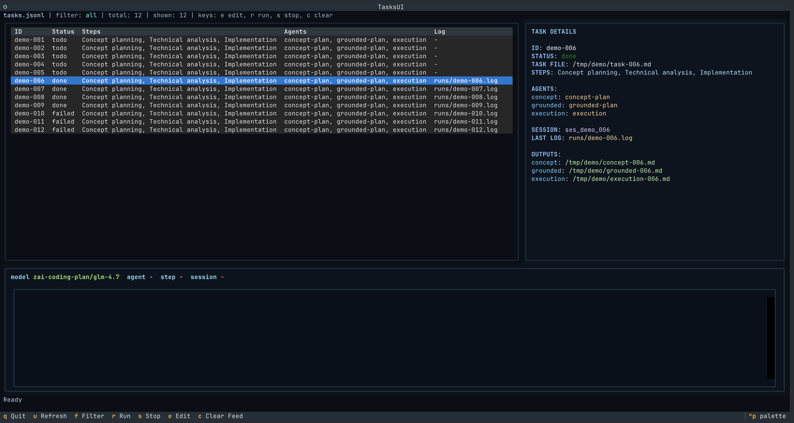

# FlowForge TUI



FlowForge TUI is a terminal task manager for running a multi-agent pipeline from `tasks.jsonl`.

It solves two core problems:
- managing a task backlog (`todo/done/failed`) in one place;
- running a fixed multi-step AI workflow (`Business plan -> Technical plan -> Execution`) with live logs and persisted results.

## What It Is For

This tool is useful when you have a long JSON task list and want to:
- pick tasks from a table in the terminal;
- edit task agents on the fly;
- run tasks and watch live events in the same screen;
- stop execution manually;
- automatically write `status`, `session_id`, `last_run_log`, and `outputs` back to `tasks.jsonl`.

## Architecture

- `tasks-ui.py`
  - main Textual UI;
  - tasks table + task details + live events feed;
  - run/stop/edit task actions.
- `pipeline_runner.py`
  - headless execution engine;
  - runs steps, streams events, writes logs, and updates `tasks.jsonl`.
- `run-task.py`
  - thin CLI wrapper: single task or scheduled batch, exit codes, locking.
- `headless_runner.py`
  - batch loop, batch limits (`FLOWFORGE_*` env), single-instance lock,
    lifecycle logging, notification dispatch.
- `notifications/`
  - generic notifier interface (`base.py`) and the Matrix implementation
    (`matrix.py`); disabled by default (`MATRIX_ENABLED=false`).
- `deploy/`
  - example systemd service + timer for autonomous server runs.

## Requirements

- Python 3.10+
- `opencode` installed and available in `PATH`
- Python packages:

```bash
pip install textual rich
```

## Configuration (Environment Variables)

Runtime paths are required via environment variables:

- `PROJECT_DIR` — target repository path where tasks are executed
- `TASKS_FILE` — path to the `tasks.jsonl` file

There is no fallback anymore: all three variables must be set (via shell env or `.env`).

Example:

```bash
export PROJECT_DIR="/path/to/project"
export TASKS_FILE="/path/to/tasks.jsonl"
python3 tasks-ui.py
```

## Quick Start

### 1. Run the UI

```bash
python3 tasks-ui.py
```

### 2. Use the UI

- `r` — run selected task
- `s` — stop active run
- `e` — edit agents
- `g` — edit global `steps.json`
- `f` — cycle filter (`all/todo/failed/done`)
- `u` — refresh table
- `c` — clear events feed
- `q` — quit

### 3. Run from CLI (no UI)

```bash
python3 run-task.py
```

Runs the next task with status `todo`.

Run a specific task:

```bash
python3 run-task.py --task-id f2-d8
```

The CLI can also process several queued tasks per invocation and send Matrix
notifications — see [docs/headless-server.md](docs/headless-server.md) for the
headless-server setup (batch limits, locking, systemd timer, Matrix).

```bash
python3 run-task.py --max-tasks 3
```

## Task Format (`tasks.jsonl`)

Each line is one JSON task object.

Minimal example:

```json
{"id":"f2-d8","task_file":"/abs/path/to/task.md","status":"todo"}
```

Extended example:

```json
{
  "id": "f2-d8",
  "task_file": "/abs/path/to/task.md",
  "status": "todo",
  "run_steps": ["execution"],
  "agents": {
    "concept": "concept-plan",
    "grounded": "grounded-hard",
    "execution": "execution-plan"
  }
}
```

`run_steps` is optional. When it is set, only those step ids run for that task, in the order listed. This is useful for rerunning only the last failed step, for example `["execution"]`. The selected step still needs its input file from the previous step to exist.

When `run_steps` is omitted and a task has `status: failed`, the runner auto-resumes by checking output files in pipeline order and starting from the first step whose output file is missing.

Pipeline steps and labels are configured in `steps.json`, not in task-level fields:

```json
{
  "steps": [
    {"id": "concept", "label": "Business plan", "agent": "concept-plan"},
    {"id": "grounded", "label": "Technical plan", "agent": "grounded-hard", "model": "model-for-grounded"},
    {"id": "execution", "label": "Execution", "agent": "execution-plan"}
  ]
}
```

If a task omits `agents`, the agents from `steps.json` are used. A task can still override agents for a specific run by setting its own `agents` object. `model` is optional per step. When omitted, the runner does not pass `--model`, so OpenCode uses the model declared by the selected agent (or its own default). Setting `model` on a step explicitly overrides the agent model.

The UI task editor uses one comma-separated agents input in the same order as `steps.json`, plus a `Run steps` input. Leave `Run steps` empty to run all steps or auto-resume failed tasks. If an entered agent is not known for its step, the UI asks whether to add it to that step in `steps.json` before saving. Added agents are stored in an optional per-step `agents` list:

```json
{"id": "execution", "label": "Execution", "agent": "execution-plan", "agents": ["custom-execution"]}
```

The global config editor (`g`) opens the current `steps.json` prefilled and can overwrite it after validation. It can also insert a new step template. Built-in step ids keep their specialized prompt/output behavior; new step ids run as generic sequential steps and write `<step-id>.md`.

## What Gets Updated After a Run

On success:
- `status: done`
- `session_id`
- `last_run_log`
- `outputs` (paths to produced files)

On failure or manual stop:
- `status: failed`
- `session_id` (if already available)
- `last_run_log`

Step logs are written to the `runs/` directory.

## Main Features

- Task table with status filtering
- Colorized task detail panel
- Modal editor for agents
- Live run header (`model/agent/step/session`)
- Streaming events feed (LLM/tool/system events)
- Manual stop for active run
- Automatic status/output persistence to `tasks.jsonl`

## Notes

- If a required input file for a step is missing, execution fails.
- Make sure `PROJECT_DIR` (or its default in `pipeline_runner.py`) points to the target repository.
